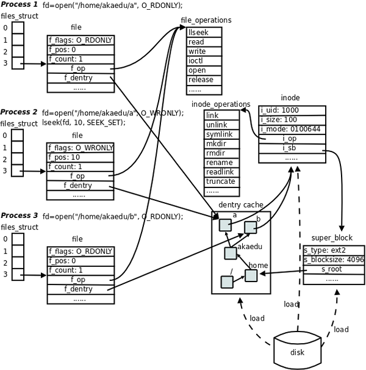

## 概览

Linux VFS 通过一组核心数据结构抽象了不同文件系统的差异，让用户态程序可以用统一的系统调用操作各种文件系统。下面是各结构体的定义和关键字段注解。



## super_block — 超级块

存储已安装文件系统的控制信息，代表一个已安装的文件系统：

```c
struct super_block {
    struct list_head s_list;                /* 指向超级块链表的指针 */
    ……
    struct file_system_type  *s_type;       /* 文件系统类型 */
    struct super_operations  *s_op;         /* 超级块方法 */
    ……
    struct list_head         s_instances;   /* 该类型文件系统 */
    ……
};
```

超级块方法：

```c
struct super_operations {
    ……
    /* 在给定的超级块下创建并初始化一个新的索引节点对象 */
    struct inode *(*alloc_inode)(struct super_block *sb);
    ……
    /* 从磁盘上读取索引节点，动态填充内存中对应的索引节点对象 */
    void (*read_inode) (struct inode *);
    ……
};
```

## inode — 索引节点

存储文件的相关信息，代表存储设备上的一个实际物理文件。注意 inode 不包含文件名——文件名存在 dentry 中：

```c
struct inode {
    ……
    struct inode_operations  *i_op;     /* 索引节点操作表 */
    struct file_operations   *i_fop;    /* 该索引节点对应文件的文件操作集 */
    struct super_block       *i_sb;     /* 相关的超级块 */
    ……
};
```

索引节点方法：

```c
struct inode_operations {
     ……
     /* 为 dentry 对象创建新的索引节点，主要由 open() 系统调用触发 */
     int (*create) (struct inode *, struct dentry *, int, struct nameidata *);

     /* 在特定目录中寻找 dentry 对象对应的索引节点 */
     struct dentry * (*lookup) (struct inode *, struct dentry *, struct nameidata *);
     ……
};
```

## dentry — 目录项

路径的各个组成部分（不管是目录还是普通文件）都是一个目录项对象。dentry 是纯内存结构，用于加速路径查找：

```c
struct dentry {
    ……
    struct inode *d_inode;           /* 相关的索引节点 */
    struct dentry *d_parent;         /* 父目录的目录项对象 */
    struct qstr d_name;              /* 目录项的名字 */
    ……
    struct list_head d_subdirs;      /* 子目录 */
    ……
    struct dentry_operations *d_op;  /* 目录项操作表 */
    struct super_block *d_sb;        /* 文件超级块 */
    ……
};
```

目录项方法：

```c
struct dentry_operations {
    /* 判断目录项是否有效 */
    int (*d_revalidate)(struct dentry *, struct nameidata *);
    /* 为目录项生成散列值 */
    int (*d_hash) (struct dentry *, struct qstr *);
    ……
};
```

## file — 文件对象

已打开的文件在内存中的表示，用于建立进程和磁盘上文件的对应关系。每次 `open()` 都会创建一个新的 `struct file`：

```c
struct file {
    ……
    struct list_head        f_list;         /* 文件对象链表 */
    struct dentry          *f_dentry;       /* 相关目录项对象 */
    struct vfsmount        *f_vfsmnt;       /* 相关的安装文件系统 */
    struct file_operations *f_op;           /* 文件操作表 */
    ……
};
```

文件方法：

```c
struct file_operations {
    ……
    ssize_t (*read) (struct file *, char __user *, size_t, loff_t *);
    ssize_t (*write) (struct file *, const char __user *, size_t, loff_t *);
    int (*readdir) (struct file *, void *, filldir_t);
    int (*open) (struct inode *, struct file *);
    ……
};
```

## file_system_type — 文件系统类型

描述具体文件系统的类型信息。每种文件系统（ext4、tmpfs、proc 等）只有一个 `file_system_type` 实例：

```c
struct file_system_type {
    const char *name;                /* 文件系统的名字 */
    struct subsystem subsys;         /* sysfs 子系统对象 */
    int fs_flags;                    /* 文件系统类型标志 */

    /* 在文件系统被安装时，从磁盘读取超级块，在内存中组装超级块对象 */
    struct super_block *(*get_sb) (struct file_system_type *,
                                    int, const char *, void *);

    void (*kill_sb) (struct super_block *);  /* 终止访问超级块 */
    struct module *owner;                    /* 文件系统模块 */
    struct file_system_type * next;          /* 链表中的下一个文件系统类型 */
    struct list_head fs_supers;              /* 同一种文件系统类型的超级块对象链表 */
};
```

## vfsmount — 安装点

每当一个文件系统被实际安装，就创建一个 `vfsmount`：

```c
struct vfsmount {
    struct list_head mnt_hash;               /* 散列表 */
    struct vfsmount *mnt_parent;             /* 父文件系统 */
    struct dentry *mnt_mountpoint;           /* 安装点的目录项对象 */
    struct dentry *mnt_root;                 /* 该文件系统的根目录项对象 */
    struct super_block *mnt_sb;              /* 该文件系统的超级块 */
    struct list_head mnt_mounts;             /* 子文件系统链表 */
    struct list_head mnt_child;              /* 子文件系统链表 */
    atomic_t mnt_count;                      /* 使用计数 */
    int mnt_flags;                           /* 安装标志 */
    char *mnt_devname;                       /* 设备文件名 */
    struct list_head mnt_list;               /* 描述符链表 */
    struct list_head mnt_fslink;             /* 具体文件系统的到期列表 */
    struct namespace *mnt_namespace;         /* 相关的名字空间 */
};
```

## 进程相关结构

### files_struct — 打开的文件集

```c
struct files_struct {
    atomic_t count;              /* 结构的使用计数 */
    ……
    int max_fds;                 /* 文件对象数的上限 */
    int max_fdset;               /* 文件描述符的上限 */
    int next_fd;                 /* 下一个文件描述符 */
    struct file ** fd;           /* 全部文件对象数组 */
    ……
};
```

### fs_struct — 进程与文件系统的关系

```c
struct fs_struct {
    atomic_t count;              /* 结构的使用计数 */
    rwlock_t lock;               /* 保护该结构体的锁 */
    int umask;                   /* 默认的文件访问权限 */
    struct dentry * root;        /* 根目录的目录项对象 */
    struct dentry * pwd;         /* 当前工作目录的目录项对象 */
    struct dentry * altroot;     /* 可供选择的根目录的目录项对象 */
    struct vfsmount * rootmnt;   /* 根目录的安装点对象 */
    struct vfsmount * pwdmnt;    /* pwd 的安装点对象 */
    struct vfsmount * altrootmnt;/* 可供选择的根目录的安装点对象 */
};
```

### nameidata — 路径查找辅助结构

```c
struct nameidata {
    struct dentry  *dentry;     /* 目录项对象的地址 */
    struct vfsmount  *mnt;      /* 安装点的数据 */
    struct qstr  last;          /* 路径中的最后一个 component */
    unsigned int  flags;        /* 查找标识 */
    int  last_type;             /* 路径中的最后一个 component 的类型 */
    unsigned  depth;            /* 当前 symbolic link 的嵌套深度，不能大于 6 */
    char   *saved_names[MAX_NESTED_LINKS + 1];
                                /* 和嵌套 symbolic link 相关的 pathname */
    union {
        struct open_intent open; /* 说明文件该如何访问 */
    } intent;                    /* 专用数据 */
};
```
