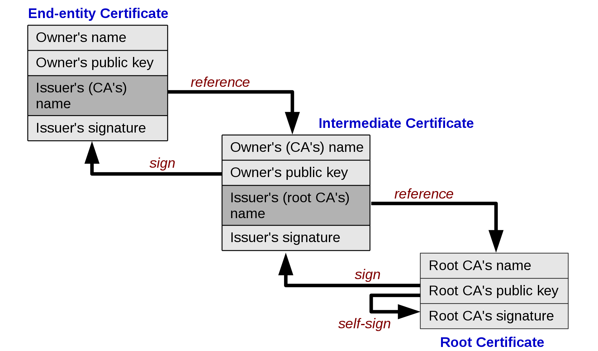

## 证书链结构

整个过程分三步：创建根证书 → 创建签名证书（由根证书签发）→ 用签名证书对文件签名。

## 完整脚本

自动化演示脚本见 [`run.sh`](run.sh)：



## 关键概念

### 文件说明

| 文件 | 说明 |
|------|------|
| `RootCA.key` | 根 CA 的 RSA 2048 私钥 |
| `RootCA.pem` | 根 CA 的自签名证书 |
| `SigCA.key` | 签名 CA 的 RSA 2048 私钥 |
| `SigCA.csr` | 签名 CA 的证书签名请求 |
| `SigCA.pem` | 由根 CA 签发的签名 CA 证书 |
| `abc.txt.p7` | PKCS7 格式的 detached 签名 |

### 验证链

验证时 OpenSSL 会检查：

1. `abc.txt.p7` 的签名者是 `SigCA.pem`
2. `SigCA.pem` 是由 `RootCA.pem` 签发的
3. `RootCA.pem` 是可信的（通过 `-CAfile` 指定）

如果任何一环断裂，验证失败。

### OpenSSL 配置文件

脚本中引用了两个 OpenSSL 配置文件（[`openssl.cfg.rootca`](openssl.cfg.rootca) 和 [`openssl.cfg.sigca`](openssl.cfg.sigca)），主要配置了证书的 DN (Distinguished Name) 默认值、证书扩展、数据库路径等。

## 相关文件与实验附件

- 证书链生成与验证脚本：[`run.sh`](run.sh)
- 根 CA OpenSSL 配置文件：[`openssl.cfg.rootca`](openssl.cfg.rootca)
- 签名 CA OpenSSL 配置文件：[`openssl.cfg.sigca`](openssl.cfg.sigca)
- 信任链示意图：[Chain_of_trust.png](Chain_of_trust.png)
