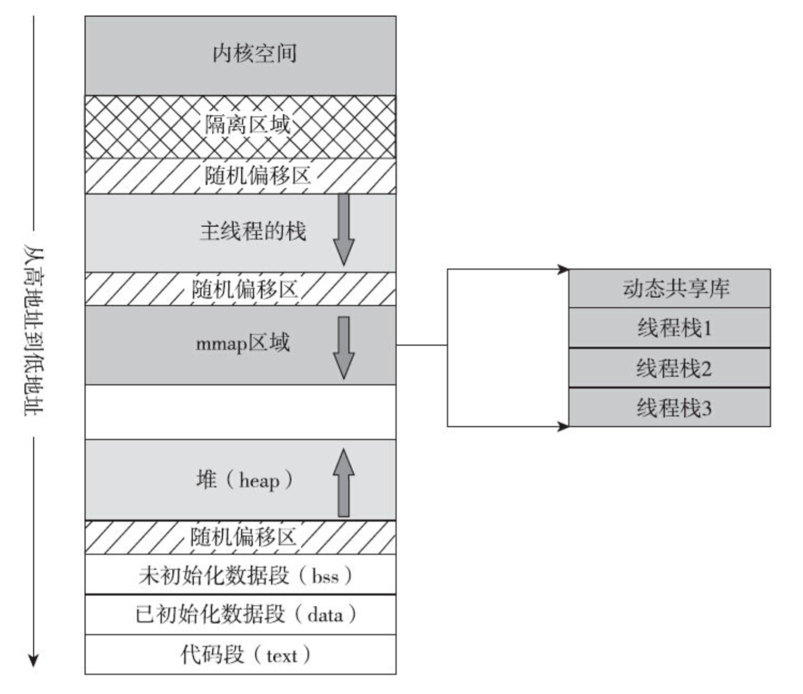

## ulimit -s

`ulimit` 可以限制系统资源。`-s` 选项控制线程栈大小，单位为 KB：

```bash
# 查看当前栈大小限制
$ ulimit -s
8192

# 设置线程栈大小为 512 KB
$ ulimit -s 512
```

## 硬限制与软限制

| 选项 | 说明 | 示例 |
|------|------|------|
| `-H` | 硬限制，一旦设置不能增加（只有 root 可以提高硬限制） | `ulimit -Hs 64` — 硬限制栈大小为 64 KB |
| `-S` | 软限制，设置后可以增加，但不能超过硬限制 | `ulimit -Sn 32` — 软限制文件描述符为 32 |



## 在代码中设置

除了命令行，也可以在程序中通过 `pthread_attr_setstacksize` 设置线程栈大小（完整示例见 [`setstacksize.c`](setstacksize.c)）：



这种方式只影响指定线程，不影响进程的全局 `ulimit` 设置。

## 相关文件与实验附件

- 线程栈大小设置演示源码：[`setstacksize.c`](setstacksize.c)
- 栈空间限制关系图：[stacksize.png](stacksize.png)
