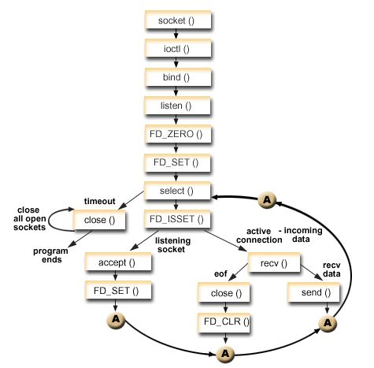

## 核心函数

`select` 系统调用的核心是 `do_select`：

```c
static int do_select(int n, fd_set_bits *fds, struct timespec64 *end_time)
```

## 获取最大文件描述符编号

```c
rcu_read_lock();
retval = max_select_fd(n, fds);
rcu_read_unlock();
```

## 注册回调函数

使用 `init_poll_funcptr` 注册回调函数 `__pollwait`。这个回调在后续轮询时被设备驱动调用，负责把当前进程添加到对应文件的等待队列：

```c
poll_initwait(&table);
wait = &table.pt;

void poll_initwait(struct poll_wqueues *pwq)
{
    init_poll_funcptr(&pwq->pt, __pollwait);
    pwq->polling_task = current;
    pwq->triggered = 0;
    pwq->error = 0;
    pwq->table = NULL;
    pwq->inline_index = 0;
}

static inline void init_poll_funcptr(poll_table *pt, poll_queue_proc qproc)
{
    pt->_qproc = qproc;
    pt->_key   = ~(__poll_t)0; /* all events enabled */
}
```

## 轮询文件描述符

调用 `struct file` 实现的 `poll` 函数进行轮询：

```c
mask = vfs_poll(f.file, wait);

static inline __poll_t vfs_poll(struct file *file, struct poll_table_struct *pt)
{
    if (unlikely(!file->f_op->poll))
        return DEFAULT_POLLMASK;
    return file->f_op->poll(file, pt);
}
```

## 驱动层 poll 实现

以 `scull_p_poll` 为例，通过 `poll_wait` 把调用 `select` 的进程挂到 `dev->inq` 和 `dev->outq` 等待队列里。当有读写事件到来时，唤醒队列里的进程，让它们重新轮询：

```c
static unsigned int scull_p_poll(struct file *filp, poll_table *wait)
{
    struct scull_pipe *dev = filp->private_data;
    unsigned int mask = 0;

    /*
     * The buffer is circular; it is considered full
     * if "wp" is right behind "rp" and empty if the
     * two are equal.
     */
    down(&dev->sem);
    poll_wait(filp, &dev->inq,  wait);
    poll_wait(filp, &dev->outq, wait);
    if (dev->rp != dev->wp)
        mask |= POLLIN | POLLRDNORM;    /* readable */
    if (spacefree(dev))
        mask |= POLLOUT | POLLWRNORM;   /* writable */
    up(&dev->sem);
    return mask;
}
```

`poll_wait` 的实现很简单，就是调用之前注册的 `_qproc`（即 `__pollwait`）：

```c
static inline void poll_wait(struct file * filp, wait_queue_head_t * wait_address, poll_table *p)
{
    if (p && p->_qproc && wait_address)
        p->_qproc(filp, wait_address, p);
}
```

`__pollwait` 负责创建一个 `poll_table_entry`，将当前进程加入文件的等待队列：

```c
/* Add a new entry */
static void __pollwait(struct file *filp, wait_queue_head_t *wait_address,
                poll_table *p)
{
    struct poll_table_entry *entry = poll_get_entry(p);
    if (!entry)
        return;
    get_file(filp);
    entry->filp = filp;
    entry->wait_address = wait_address;
    init_waitqueue_entry(&entry->wait, current);
    add_wait_queue(wait_address, &entry->wait);
}
```

## 返回条件

`retval` 保存检测到的可操作文件描述符个数。如果有文件可操作，则跳出 `for(;;)` 循环直接返回；若没有文件可操作且 timeout 时间未到同时没有收到 signal，则调用 `schedule_timeout` 睡眠，直到被唤醒后重新轮询：

```c
if (retval || timed_out || signal_pending(current))
    break;
```


