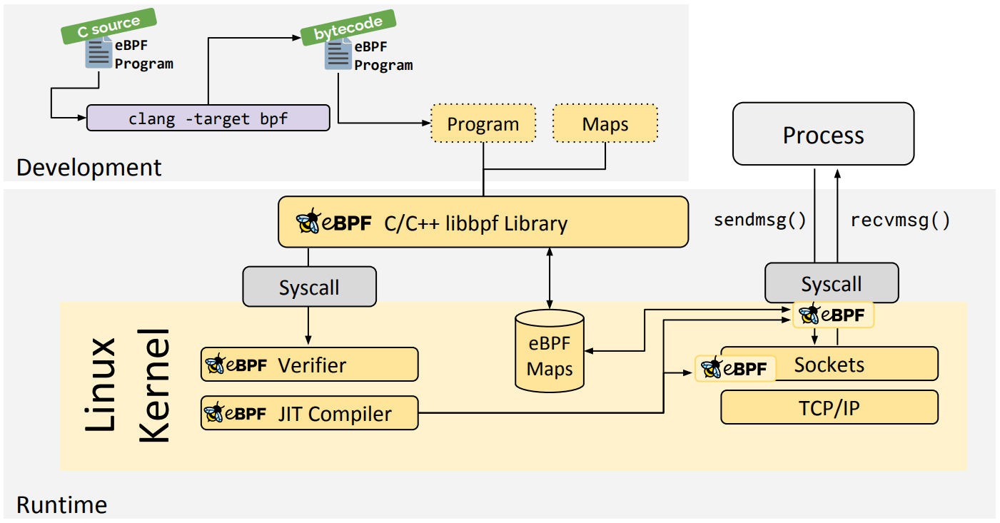

## BCC 与 libbpf / CO-RE

传统的 BCC（BPF Compiler Collection）开发模式是在目标机器上嵌入 Clang/LLVM 编译器，程序运行时拉取本机的内核头文件（`linux-headers`）并动态编译 BPF 源码。这种方式在嵌入式设备或生产环境中问题很明显：
- Clang/LLVM 体积过大，资源占用高
- 强依赖目标机的内核头文件包
- 首次加载编译延迟大

BPF CO-RE（Compile Once – Run Everywhere）通过结合内核 BTF 和 `libbpf`，将编译过程前置到构建机，目标机上只需轻量的加载器即可运行：



## CO-RE 核心机制

CO-RE 的跨内核版本兼容主要依赖以下三部分：

1. **BTF (BPF Type Format)**：内核内置的高紧凑类型元数据（开启 `CONFIG_DEBUG_INFO_BTF=y`），在运行时通过 `/sys/kernel/btf/vmlinux` 暴露当前内核完整的数据结构定义。
2. **`vmlinux.h`**：通过 `bpftool` 从内核 BTF 中直接导出全量结构体与类型定义，替代零散的系统头文件依赖。
3. **重定位与 Offset Fixup**：Clang 编译时通过 `__builtin_preserve_access_index()` 记录结构体字段的逻辑访问路径；`libbpf` 在加载阶段比对目标机内核的 BTF，就地改写字节码中的字段物理偏移。

## Step-by-Step 构建流程

BPF CO-RE 程序的标准构建链路如下：

### 1. 导出内核类型定义
```bash
$ bpftool btf dump file /sys/kernel/btf/vmlinux format c > vmlinux.h
```

### 2. 编译 BPF 目标文件
```bash
$ clang -g -O2 -Wall --target=bpf -D__TARGET_ARCH_arm64 -I. -c prog.bpf.c -o prog.bpf.o
```
> 注：必须保留 `-g` 选项，Clang 依赖调试信息生成 BTF 与重定位段。

### 3. 生成 Skeleton 脚手架头文件
```bash
$ bpftool gen skeleton prog.bpf.o > prog.skel.h
```
生成的 skeleton 头文件包含了内嵌的 BPF 字节码，以及 `prog_bpf__open()`、`prog_bpf__load()`、`prog_bpf__attach()`、`prog_bpf__destroy()` 等生命周期控制函数。

### 4. 编译用户态程序
```bash
$ aarch64-buildroot-linux-gnu-gcc prog.c -I. -lbpf -lelf -lz -o prog
```

## 嵌入式环境与内核配置

在目标机内核配置中，需要开启以下关键选项：

```kconfig
CONFIG_BPF=y
CONFIG_BPF_SYSCALL=y
CONFIG_BPF_EVENTS=y
CONFIG_DEBUG_INFO_BTF=y
CONFIG_KPROBES=y
CONFIG_FTRACE=y
```

## 参考与示例工程

- 嵌入式 BPF 示例工程：[ShenChen1/bpf-core-example](https://github.com/ShenChen1/bpf-core-example)
  包含 tracepoint、kprobe、fentry、uprobe、usdt、sockfilter、tc 等 10 种程序的完整实现，以及基于 Buildroot / AArch64 QEMU 的交叉编译与调试配置。
- [BPF CO-RE Reference Guide - Andrii Nakryiko](https://nakryiko.com/posts/bpf-core-reference-guide/)
- [BPF Documentation - kernel.org](https://www.kernel.org/doc/html/latest/bpf/)
